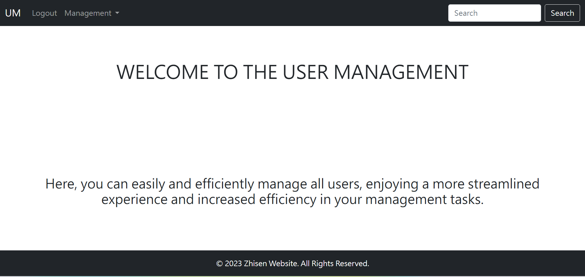
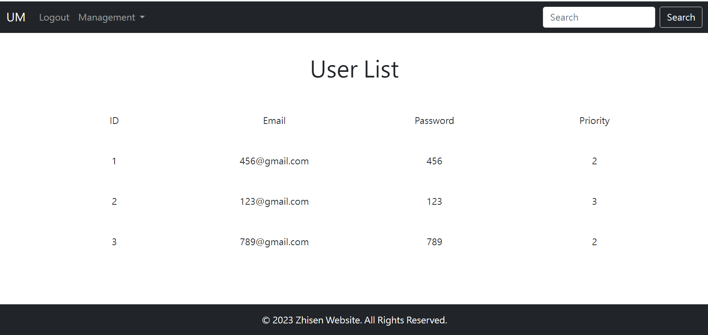
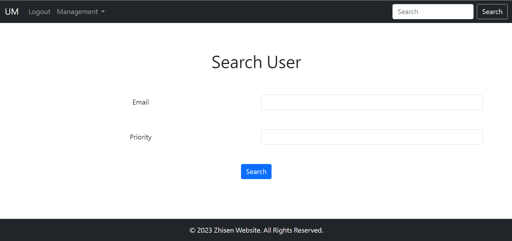
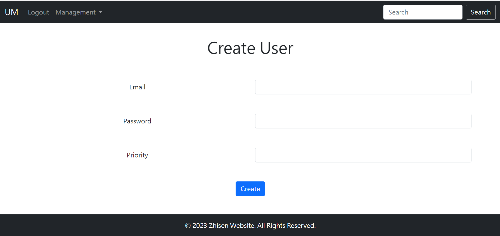
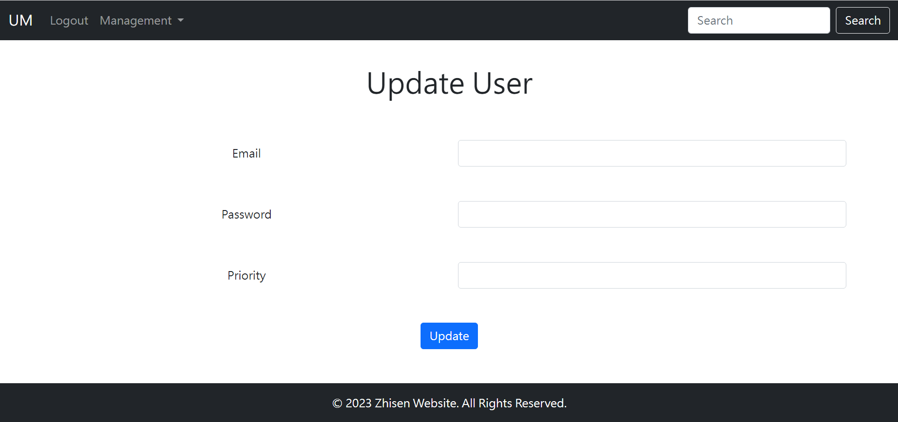

# User_Management
This is a web application developed using the Flask framework in Python, allowing administrators to manage all users.


## Installation
Install the following extensions using pip:

```
$ pip install Flask-SQLAlchemy

$ pip install flask-login

$ pip install pytest

$ pip install Flask-Migrate

$ pip install Flask
```

You can also install all the required extensions at once using the following command:
```
$ pip3 install -r requirements.txt
```

You need to create a database named "data" in MySQL:

```sql
CREATE SCHEMA `data` ;
```


## To start

Enter the following command to start the web application:

```
$ git clone https://github.com/Jiangzhisen/User_Management.git
$ cd User_Management
$ python app.py
```


## Usage
1. First, enter http://127.0.0.1:5000/login in your web browser.

2. Then proceed to log in to the system.


3. After logging in, you will be directed to the homepage.



1. Clicking on the "User List" link allows you to view a list of all users.




5. In the "search_user" section, enter Email and Priority to search for users that match the criteria.



6. In the "create_user" section, enter Email, Password, and Priority to create a new user.



7. In the "update_user" section, enter Email, Password, and Priority to update user information.



8. In the "delete_user" section, enter Email to delete a specific user.


## API

### user_list = get_user_(email, priority)

**Generate a user_list object using the variables email and priority.**

- email (required) - Email of the user
- priority (required) - Priority of the user

>Show how to retrieve a list of user objects that meet the specified criteria. Both the email and priority parameters are required for this operation.

### result = create_user(email, password, priority)

**Create a user using the variables email, password and priority.**

- email (required) - Email of the user
- password (required) - Password of the user
- priority (required) - Priority of the user

>Show how to create a user, with the email, password, and priority parameters being required.

### result = update_user(email, password, priority)

**To update user information using email, password, and priority.**

- email (required) - Email of the user
- password (required) - Password of the user
- priority (required) - Priority of the user

>Show how to update user information with the required parameters: email, password, and priority.

### result = delete_user(email)

**To delete a specific user using email.**

- email (required) - Email of the user

>Show how to delete a specific user with the required parameter: email.


### http://127.0.0.1:5000/users

**Retrieve a list of all users.**


### http://127.0.0.1:5000/user/detail

**Query users that match the criteria.**

Need to include JSON data in the following format:

```json
{
    "email": "456@gmail.com",
    "priority": "2"
}
```


### http://127.0.0.1:5000/user/create

**Create a new user.**

Need to include JSON data in the following format:

```json
{
    "email": "987@gmail.com",
    "password": "987",
    "priority": "3"
}
```


### http://127.0.0.1:5000/user/update

**Update information of a user.**

Need to include JSON data in the following format:

```json
{
    "email": "987@gmail.com",
    "password": "789",
    "priority": "9"
}
```


### http://127.0.0.1:5000/user/delete

**Delete a user.**

Need to include JSON data in the following format:

```json
{
    "email": "987@gmail.com"
}
```


## Pytest

Enter the following command to run pytest.

```
$ python -m pytest
```                                                          


## Contributing

Thank you for thinking of contributing!

If you discover any bugs in this system or have suggestions for improvement, please feel free to email us and discuss!

**Email: zzzz4444450@gmail.com**


